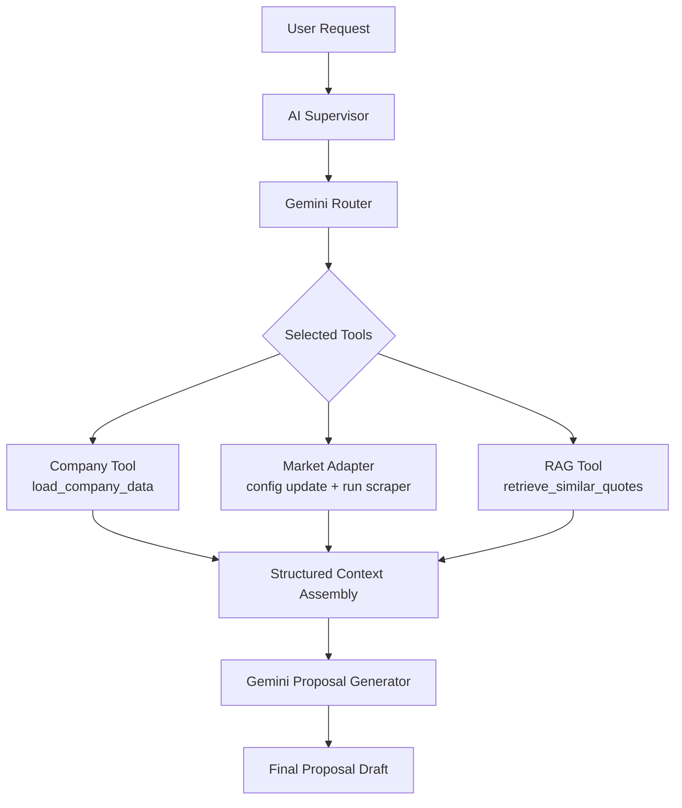

# AI Proposal Intelligence System

An enterprise AI prototype that automates proposal drafting by orchestrating company data, market intelligence, and historical quotations through a single AI Supervisor.

This project is intentionally built as a hackathon prototype to demonstrate:
- AI orchestration
- LangChain routing and tool calling
- Retrieval-augmented generation (RAG)
- Modular architecture for team-based development

## Project Overview

In a manual workflow, a marketing or sales executive typically:
- Searches previous quotations
- Checks internal company pricing
- Reviews current market prices and exchange rates
- Drafts a formal quotation

This system automates that process by using a supervisor to decide which tool modules to call, assemble context, and generate the final proposal with Gemini.

## Architecture Diagram



## Technology Stack

- Python
- LangChain (routing and orchestration)
- Gemini via `langchain-google-genai`
- FAISS + sentence-transformers (RAG)
- BeautifulSoup + requests + Playwright (market scraping module)
- Pydantic (structured route schema)

## Folder Structure

```text
automation/
├── supervisor.py
├── 01_excel_ingestion.py
├── 02_pdf_ingestion.py
├── 03_market_api.py
├── 04_clean_validate.py
├── 05_export_json.py
├── RAG_Module/
│   └── RAG/rag_module/
│       ├── retriever.py
│       ├── build_index.py
│       └── ...
└── Scraping and Converstion module/
    ├── main.py
    ├── config.py
    ├── scraper.py
    └── exchange.py
```

## Installation

1. Create and activate a virtual environment.
2. Install dependencies:

```bash
pip install -r requirements.txt
```

3. Install Playwright browser binaries (required by market module fallback):

```bash
python -m playwright install
```

## Environment Variables

Create a `.env` file in the project root (same folder as `supervisor.py`) using `.env.example`.

Required variables:
- `GOOGLE_API_KEY`: your Gemini API key
- `GEMINI_MODEL_NAME`: defaults to `gemini-1.5-flash`

Example:

```env
GOOGLE_API_KEY=your_real_api_key
GEMINI_MODEL_NAME=gemini-1.5-flash
```

If `GOOGLE_API_KEY` is missing, the supervisor returns a clear configuration error instead of attempting Gemini generation.

## How to Run

Minimal usage with `ProposalSupervisor.run()` as the public entry point:

```python
from supervisor import build_default_supervisor

# Inject team module interfaces where available
# load_company_data: callable() -> structured company data
# retrieve_similar_quotes: callable(query: str, k: int = 3) -> retrieval results

supervisor = build_default_supervisor(
    load_company_data=load_company_data,
    retrieve_similar_quotes=retrieve_similar_quotes,
)

result = supervisor.run("Generate quotation for HP Victus i5 in India")
print(result)
```

## How Each Team Module Fits Together

- Company Data Module (Module 1)
  - Interface consumed by supervisor: `load_company_data()`
  - Role: internal pricing and structured company data.

- RAG Module (Module 2)
  - Interface consumed by supervisor: `retrieve_similar_quotes(query, k)`
  - Role: retrieve semantically similar historical quotations.

- Market Module (Module 3)
  - Kept as standalone black-box scraper (unchanged).
  - Supervisor uses an adapter to:
    - write `TARGET_COUNTRY` and `LAPTOP_MODEL` into market `config.py`
    - run market `main.py`
    - capture terminal output as string context.

## How the Supervisor Works

1. Receives user request.
2. Gemini Router returns `ProposalRoute` with:
   - `selected_tools`
   - `retrieval_query`
   - `retrieval_k`
   - `market_inputs` (`country`, `laptop_query`) when market tool is selected
3. Supervisor executes only selected tools.
4. Market adapter output is added under `## Market Data` in assembled context.
5. Gemini Generator creates final proposal draft.
6. `ProposalSupervisor.run()` returns the final text.

## Future Improvements

- Add stricter validation and fallback normalization for router-extracted market inputs.
- Add parsing layer to convert market terminal output into structured fields.
- Add caching for repeated market and RAG calls.
- Add integration tests for multi-tool routes.

## Known Limitations

- Market module output is captured as terminal text, not JSON.
- Adapter rewrites market `config.py` for each market call.
- Prototype-grade error handling and observability.
- Accuracy depends on upstream scraper and retrieval quality.
